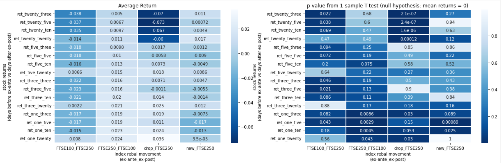

# QF603_QAFM_Project: An index rebalancing arbitrage strategy using stock price prediction with LSTM
Project Repository for QF603

Team members: 
- Abigail Choo
- Jennifer Claudia Gozal
- Lee Chew Peng (Caden)
- Ong Kuei Hsien (Kenn)

## Project Objective

The objective of this project is to develop a predictive model, capable of forecasting prices of stocks that are likely to be included into or excluded from an equity index and apply its predictive prowess to preempt such inclusion and exclusion so as to take advantageous positions ahead of index rebalancing.

## Project Justification
As with all equity indices, index rebalancing occurs periodically, typically once a quarter or annually. During a rebalance, existing constituents that no longer meet the index criteria would be excluded, and stocks that are next-in-line that meet the criteria will be included. 

When new stocks are included and old stocks are excluded, fund managers and market makers are forced to purchase the new stocks and sell the old stocks in order to match the new index composition. Therefore, assuming an efficient market, the newly included stocks will experience an increased demand, which in turn impacts price, while the excluded stocks would likely fall in price due to market forces. The change in composition at the same time will impact futures trading as well, with the back-month futures contract being transiently mispriced due to the change in constituents.

While it relies on the basic law of supply and demand, the affected stock would have gained prominence due to greater/lower visibility after rebalancing. Apart from the simple strategy of buying potential constituents and correspondingly selling the replaced, there are additional steps we can take to increase performance of this strategy:
1. Being able to predict a few days before the changes are officially announced - this would allow us to "front-run" the demand
2. Estimating the change in price caused by this increase/decrease in demand - this will allow us to manage our size and cut potential loss while ensuring that we're paying a fair value for the purpose of this strategy 
3. Ensuring that Beta of this execution is hedged out, I.e. achieving dollar neutrality

We would be focusing on step 1 for the purpose of this project and steps 2 and 3 if time permits. 

In this project, we will be using Long short-term memory (LSTM) model to predict the price of the target stocks ahead of the rebalancing.

## Project Highlights

### Stocks Universe Selection

The stock universe selected for this exercise is the FTSE100 and FTSE250 indices. The choice of the indices is due to the simplicity of the index methodology:
- the stocks are ranked on the Tuesday on the week of the 1st Friday of the rebalancing month; index constitution shall be based on this market cap ranking for inclusion (and exclusion)
- the rebalancing day is at the end of the 3rd Friday of the rebalancing month (usually coinciding the futures market expiry); here we define the first trading day after the rebalancing day as the post-date

In our analysis and trading strategy, 
- we analyzed all rebalancing cycles in the past years, ranging from 2013 - 2023 in our ex-post analysis
- trading strategy applies on the last year of the scope, i.e. 2023

For reasonable reason of purely trading on the rebalancing effect, we shall omit the following stocks:
- Stocks which rebalancing dates fall within the announcement date and the ex date of a corporate action

In addition, for the ex-post analysis the following stocks are excluded
- Stocks that are suspended from trading within the analysis period (+/- 20 days from rebalancing date)
- Stocks that we are unable to obtain a reliable historical data on
- All Q3 2023 rebalancing; at time of study we are unable to obtain 20 days after the rebalancing date

### Ex Post Analysis

In order to ascertain that our hypothesis is true, and that there is an arbitrage opportunity to reap from index rebalancing, an ex-post analysis is conducted based on perfect hindsight on the index constituent changes. Based on data from 2013 - 2023, we observed statistical significant positive returns if one shorts stocks that exits FTSE100 (into FTSE250) and FTSE250 (into small cap) one week prior to rank day, or long stocks that enters FTSE100 (from FTSE250) and FTSE250 (from small cap) one day prior to rebalancing day.

One may refer to `04_Post_Rebal_Analysis.ipynb` for more details. 
